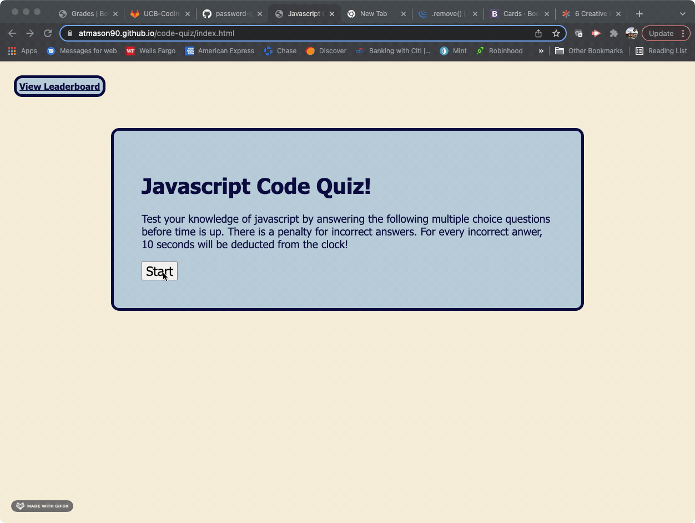

# Code Quiz


## Purpose of this Project

The purpose of this project was to create a coding assessment to test the user's knowledge of basic javascript concepts. The format of this application is a timed quiz with multiple choice questions. 

This application runs in the browser via JavaScript code and features dynamically updated HTML and CSS. Some interesting features included in this application are: a timer function that penalizes the user for incorrect answers by deducting time from the clock, automatically presenting the user the next question when an answer is submitted, and the ability for the user to save their highscores in local storage and view them on a leaderboard page that shows historical results.

## Application Demo



## Code Examples

This example displays my use of an event listener to start the game timer when the start button is clicked by the user.

```js
startGame.addEventListener("click", function() {
    if (timerInterval === 0) {
        timerInterval = setInterval(function() {
            startingTime--;
            timeLeft.textContent = "Seconds Left: " + startingTime;

            if (startingTime <= 0) {
                clearInterval(timerInterval);
                endGame();
                timeLeft.textContent = "Out of Time!"
            }
        }, 1000);
    }
    render(questionNumber);
});
```

This example displays how I utilized a for loop and and a for each function to render each question and it's choices to the page. 

```js
function render(questionNumber) {
    questionNumber.innerHTML = "";
    createList.innerHTML = "";
    
    for (var i = 0; i < questions.length; i++) {
        var displayQuestion = questions[questionNumber].question;
        var displayChoices = questions[questionNumber].choices;
        quizQuestion.textContent = displayQuestion;
    }
    
    displayChoices.forEach(function (newEl) {
        var li = document.createElement("li");
        li.textContent = newEl;
        quizQuestion.appendChild(createList);
        createList.appendChild(li);
        li.addEventListener("click", (compareAnswer));
    })
}
```

This example displays the methodology is used to determine if the user's choice was the correct answer. 

```js
function compareAnswer(e) {
    var selection = e.target;
    
    if (selection.matches("li")) {
        var createDiv = document.createElement("div");
        createDiv.setAttribute("id", "createDiv");
        if (selection.textContent == questions[questionNumber].answer) {
            currentScore++;
            createDiv.textContent = questions[questionNumber].answer + " is correct!";
        } else {
            startingTime = startingTime - incorrectPenalty;
            createDiv.textContent = "That is incorrect, the answer is: " + questions[questionNumber].answer;
        }
    }
    questionNumber++;

    if (questionNumber >= questions.length) {
        endGame();
        createDiv.textContent = "Game Over! You correctly answered " + currentScore + "/" + questions.length + " questions";
    } else {
        render(questionNumber);
    }
    quizQuestion.appendChild(createDiv);
}
```

## Links

Deployed Application:
https://atmason90.github.io/code-quiz/

GitHub Repository:
https://github.com/atmason90/code-quiz 


## Technologies Used


## License

MIT License

Copyright (c) 2022 Andrew Mason

Permission is hereby granted, free of charge, to any person obtaining a copy
of this software and associated documentation files (the "Software"), to deal
in the Software without restriction, including without limitation the rights
to use, copy, modify, merge, publish, distribute, sublicense, and/or sell
copies of the Software, and to permit persons to whom the Software is
furnished to do so, subject to the following conditions:

The above copyright notice and this permission notice shall be included in all
copies or substantial portions of the Software.

THE SOFTWARE IS PROVIDED "AS IS", WITHOUT WARRANTY OF ANY KIND, EXPRESS OR
IMPLIED, INCLUDING BUT NOT LIMITED TO THE WARRANTIES OF MERCHANTABILITY,
FITNESS FOR A PARTICULAR PURPOSE AND NONINFRINGEMENT. IN NO EVENT SHALL THE
AUTHORS OR COPYRIGHT HOLDERS BE LIABLE FOR ANY CLAIM, DAMAGES OR OTHER
LIABILITY, WHETHER IN AN ACTION OF CONTRACT, TORT OR OTHERWISE, ARISING FROM,
OUT OF OR IN CONNECTION WITH THE SOFTWARE OR THE USE OR OTHER DEALINGS IN THE
SOFTWARE.